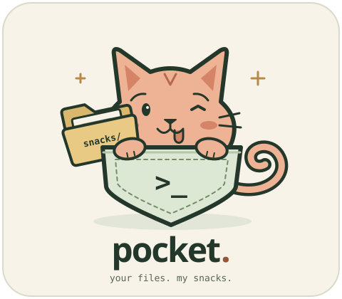

# Pocket

<!--<p align="center">
  
</p>-->


<p align="center">
  <a href="https://www.kernel.org/"></a>
  <a href="https://github.com/anomalyco/opentui"></a>
  <a href="https://bun.sh/"></a>
  <a href="https://www.rust-lang.org/"></a>
  <a href="https://github.com/tmux/tmux"></a>
</p>

A cat-sized OpenTUI file manager. Peach labels, mint selection, compact panels, clickable places and a keyboard guide built into `?`.

- Browse folders, filter names, show hidden files and scroll text previews.
- Press `B` to add or remove the current folder's bookmark. Press `b` to jump to one, or click it in the places sidebar.
- Preview PNG, JPEG, WebP and GIF using OpenTUI's native image decoder. tmux uses terminal blocks, so images also work over SSH.
- Read music tags and a real waveform. Space starts or stops playback with ffplay.
- Open audio/video-only folders as playlists in the host's default player. Select a file inside to start the playlist there.
- Press `e` to edit text with `$EDITOR`, with `vi` as the fallback. Enter opens any selected file or folder in the host's default app. Press `o` to open any selected file externally.
- Create files and folders, rename, copy, cut and paste. Existing files are protected. Moving to system trash uses a compact confirmation with Cancel selected by default.
- Split panes and open shell tabs with tmux. The Rust SSH server attaches clients to that same session, including the running editor.
- Press `s` for an SSH QR code, pairing password and host fingerprint.

## Run

Linux is the supported host. Install Bun, Rust, tmux 3.3 or newer and GNU coreutils. FFmpeg enables audio metadata, waveform and playback. `gio`, supplied by GLib, enables system trash and default-app opening. `xdg-open` from xdg-utils is the fallback opener.

For example, on Debian or Ubuntu:

```sh
sudo apt install tmux coreutils ffmpeg libglib2.0-bin openssh-client
bun install
bun run start
```

Open a particular folder:

```sh
EDITOR='nvim' bun run start ~/Documents
```

Start just the file manager, without SSH or tmux:

```sh
bun run dev
# Or:
bun src/index.ts ~/Documents
```

The sidebar disappears on smaller terminals. Below 72 columns, Tab switches between the file list and preview. Search uses a one-line field above the file list, so matching files remain visible while you type. Enter opens the selected file or folder in the host's default app from either panel. Selecting text with the mouse copies it using OSC 52 when you release the button, including the pairing password in the SSH dialog. Your terminal must allow clipboard writes.

New file/folder, Rename and Go to folder use small centered input dialogs. In the trash confirmation, use Left/Right or Tab to choose, Enter to activate, or Esc to cancel. Both choices are clickable; trash failures leave the dialog open for retry.

Bookmarks persist in `$XDG_DATA_HOME/pocket/bookmarks.sqlite`, or `~/.local/share/pocket/bookmarks.sqlite` when that variable is unset. Pressing `B` again removes the bookmark without deleting the folder. The bookmark picker also works on narrow terminals where the sidebar is hidden.

Videos such as MKV and MP4, PDFs, office documents, archives and unrecognized binary files open using the host's file associations. Nothing launches just from selecting a file. Pocket stays responsive while the external app runs, and the app stays independent of Pocket. External windows and playback appear on the host, not the SSH client; the host needs a desktop session and an associated application.

`Enter` or `o` on a folder containing only recognized audio/video files opens a playlist in natural filename order. Inside that folder, opening a file starts there, continues through the later files, then wraps to the earlier ones. Hidden and filtered siblings are included. Images, non-media files, subfolders or an empty folder keep normal default-app opening; folders are not scanned recursively.

Pocket writes private `.m3u8` playlists in the system temporary directory and opens them using the host's playlist file association. They remain available after Pocket exits and rely on OS temporary-file cleanup.

For example, make mpv the host's default for MP4, MKV and playlists:

```sh
xdg-mime default mpv.desktop video/mp4 video/x-matroska
xdg-mime default mpv.desktop audio/x-mpegurl audio/mpegurl application/x-mpegurl application/vnd.apple.mpegurl
```

## Build one executable

Build on a Linux glibc host with Bun and Rust installed:

```sh
bun install
bun run build
./pocket ~/Documents
```

The output is exactly `./pocket`, containing the Rust SSH server, compiled TUI, Bun runtime and OpenTUI native assets. Copy that one file to a compatible Linux machine; no Bun, Rust, source checkout or `node_modules` is needed there. Builds use the host architecture and are not universal or fully static.

Runtime tools remain external: tmux 3.3+, GNU coreutils and a shell. FFmpeg, `gio` and `xdg-open` remain optional as described above. Pocket extracts the embedded TUI into a private directory with owner-only permissions and removes it on normal server shutdown. The temporary filesystem must allow execution; set `TMPDIR` to a writable, executable filesystem if yours is mounted `noexec`.

## Join from another device

By default, SSH listens only on `127.0.0.1:2222`. To allow another device on your LAN, supply this computer's LAN address:

```sh
bun run start ~/Documents --listen 0.0.0.0:2222 --host 192.168.1.42
```

Press `s`, then scan the QR with an SSH app that supports `ssh://` links. A normal camera app may not open these links. You can also enter the shown SSH command manually:

```sh
ssh -t -p 2222 pocket@192.168.1.42
```

Compare the client's host fingerprint with the one shown in Pocket before accepting the connection. Enter the random password shown in the share dialog. That password lasts for this server run. The QR contains the address, not the password.

All clients share control. Navigation, edits, panes and tabs are visible to everyone. Disconnecting a client does not end the session. Audio plays through the host's audio device, not through the remote SSH client.

For public-key-only access:

```sh
bun run start --keys-only --authorized-keys ~/.ssh/id_ed25519.pub
```

Without `--authorized-keys`, the server reads `~/.ssh/authorized_keys`. It accepts plain key lines only. Entries with restrictions such as `from=` or `command=` are skipped rather than silently granting unrestricted access. The SSH login name is always `pocket`, independent of your OS username.

The persistent Ed25519 host key is stored at `~/.local/share/pocket/ssh_host_ed25519_key` with private permissions. Use `--state-dir` to choose another location.

For an unattended session:

```sh
bun run start ~/Documents --headless --listen 0.0.0.0:2222 --host 192.168.1.42
```

Headless mode prints the pairing password to standard output. Keep that output private, or use `--keys-only`.

## Keys

| Key | Action |
| --- | --- |
| Arrows, j / k | Navigate files |
| Enter | Open in the host's default app; media-only folders and files inside them open a playlist |
| Right, l | Step into a folder or open a file |
| Left, h, Backspace | Parent folder |
| Tab | Switch files and preview focus |
| / | Open the inline filename filter above the file list |
| Enter while filtering | Keep the filter and return to results |
| Esc | Close dialog or clear filter |
| . | Show hidden files |
| g | Go to a folder |
| B | Add / remove the current folder's bookmark |
| b | Choose a bookmark and press Enter to jump |
| e | Edit with `$EDITOR` |
| o | Open the selected file in the host's default app, also from preview |
| n / Shift+n | New file / folder |
| r | Rename |
| y, then p | Copy, then paste into the current folder |
| x, then p | Cut, then move into the current folder without overwriting |
| d | Move to system trash, with confirmation |
| Space | Play / stop music |
| F5 | Refresh |
| s | Share SSH connection |
| ? | All shortcuts |
| q | Close the file manager pane |

Cut leaves the original in place until you paste with `p`. A failed paste keeps the cut queued for retry; a successful move clears it. Copy with `y` stays available for repeated pastes.

Tmux uses its normal prefix, Ctrl+B. Release it, then press `%` to split left/right, `"` to split top/bottom, `c` for a shell tab, arrows to switch panes, or `n` / `p` to switch tabs. `d` detaches your local terminal while the Rust server keeps running.

The server stops when the last pane exits or when you interrupt the server process. Stopping it closes all panes, so save editor buffers first. Do not run it as root. SSH users have your filesystem and shell permissions. This is for trusted people, not a sandbox or a public hosting service. Arbitrary SSH exec, SFTP, forwarding and agent forwarding are disabled, but authenticated users can open shells inside tmux.

## Checks

```sh
bun test
bun run check
bun run server:test
cargo clippy --manifest-path server/Cargo.toml -- -D warnings
bun run ssh:test
bun run binary:test
```

`bun run binary:test` builds `./pocket`, copies it into a clean directory, then runs the SSH smoke test with Bun and Cargo absent from the server's PATH. It also checks extraction permissions and cleanup.

The SSH smoke test starts a real Rust server and two real SSH clients. It checks key and password authentication, shared file creation, `$EDITOR`, preview and selection clipboard forwarding, the share dialog, resizing, disconnect survival, rejected unauthenticated access and rejected SSH exec.

Text previews read at most 64 KB and show up to 500 lines. Image files larger than 32 MB are not decoded. Waveforms sample the first 30 seconds. Directory changes made outside Pocket appear after F5.
